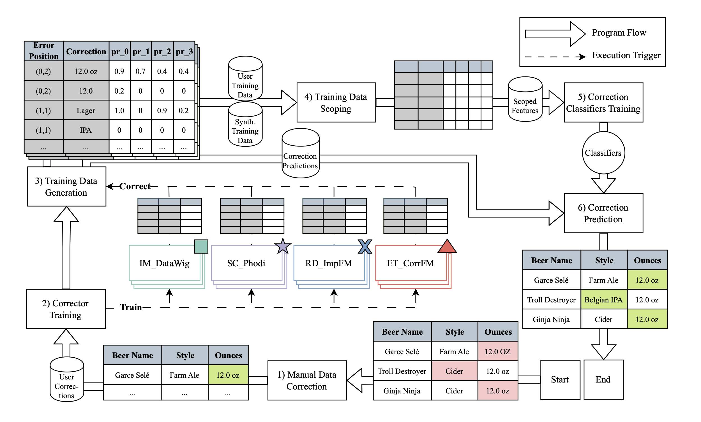

# Mimir++: An Advanced Data Repairing System

Mimir++ is an extended version of Mimir, where the request to the OpenAI API for RD_ImpFM and ET_CorrFM is redirected to a local llama.cpp server. In addition, ET_CorrFM has been enhanced with multi-layer transformation analysis, allowing large datasets or those with many errors to be corrected by a local LLM within a practical runtime. The rest of Mimir remains unchanged. Mimir++ was developed as part of a bachelor thesis. Therefore, many thanks to Philipp for allowing me to use Mimir as a basis for my thesis and for the support! :)

The llama.cpp server can be imported with the script 'build_llama_server.sh'. This script clones the llama.cpp repo and builds the server.
In addition to the llama.cpp server, LMStudio for multi-layer transformation analysis (llm_transformation) is currently required to host the reasoning model. Since the llama.cpp server did not support stable execution of a reasoning model at the end of development, once it does, the request can be sent directly to the llama.cpp server instead of the LMStudio server.

I also exported my conda environment (environment2.yml) because the environment.yml didnt not work for me.

I recommend 'Meta-Llama-3.1-8B-Instruct-Q6_K_L' for RD_ImpFM and ET_CorrFM and 'DeepSeek-R1-Distill-Qwen-14B-Q4_K_M' with 'Codestral-22B-v0.1-Q2_K.gguf' for the multilayer transformation analysis. For slightly lower quality (F1 ~-0.02), 'Llama-3.2-1B-Instruct-F16.gguf' has amazing quality for its size and is very fast.

Below is Mimir's ReadME with further installation instructions:  

Mimir is a state-of-the-art error correction system.

## Installation
Instructions have been tested on MacOS 14.5 on an Apple M2 Chip.
They should work on UNIX systems and on an amd64 processor architecutre, too.
Running Mimir on Windows is untested.

### Recommended: Local installation via Conda
Mimir can be executed on using `conda` or `mamba`.
To install Mimir on your machine, follow these steps:

1) Install Miniforge3 on you machine.\
Follow the [official installation instructions](https://github.com/conda-forge/miniforge#download).
1) Clone this repository `git clone https://github.com/philipp-jung/mimir.git`.
1) Navigate into the newly cloned directory with `cd mimir`, then, run `conda env create -n mimir -f environment.yml` to create a new conda environment called `mimir`.
1) Run `conda activate mimir` to activate the `mimir` environment.
1) Navigate into the `src/` folder in the `mimir/` directory.
1) Run `python correction.py` to correct sample data errors. Set parameters at the bottom of `correction.py` to adjust the correction process.

### Running Mimir in a container
Mimir can be run as a container as well.

1) Build an image `docker build -t <your_docker_username>/mimir:latest .` Consult the [`docker buildx` documentation](https://docs.docker.com/reference/cli/docker/buildx/) for cross-platform builds.
1) The measurement carried out by the container is controlled by using environment variables. The `CONFIG` environment variable is a serialized hashmap that contains all parameters that Mimir's `Corrector` object is configured with as keys, and an additional parameter called `run`. The `EXPERIMENT_ID` is used to identify experiments, set it to your liking.
1) You can run a container that cleans the `hospital` dataset, using Mimir's full ensemble of correctors by executing `docker run -e CONFIG='{"dataset": "hospital", "n_rows": null, "error_fraction": 1, "error_class": "simple_mcar", "labeling_budget": 20, "synth_tuples": 100, "auto_instance_cache_model": true, "clean_with_user_input": true, "gpdep_threshold": 0.3, "training_time_limit": 600, "llm_name_corrfm": "gpt-3.5-turbo", "feature_generators": ["auto_instance", "fd", "llm_correction", "llm_master"], "classification_model": "ABC", "vicinity_orders": [1], "vicinity_feature_generator": "naive", "n_best_pdeps": 3, "synth_cleaning_threshold": 0.9, "test_synth_data_direction": "user_data", "pdep_features": ["pr"], "fd_feature": "norm_gpdep", "sampling_technique": "greedy", "run": 0}' -e EXPERIMENT_ID=hospital-all-correctors <your_docker_username>/mimir:latest`

## Benchmarks
To run our benchmarking experiments, consider the `README.md` file in the the `benchmarks/` directory.

## Notebook
In the `notebook/` directory, we provide the code used to generate all figures used in the Mimir publication.
